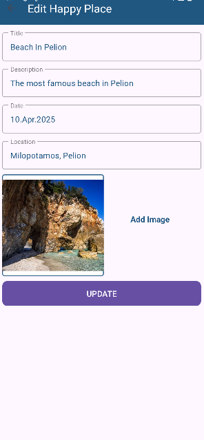
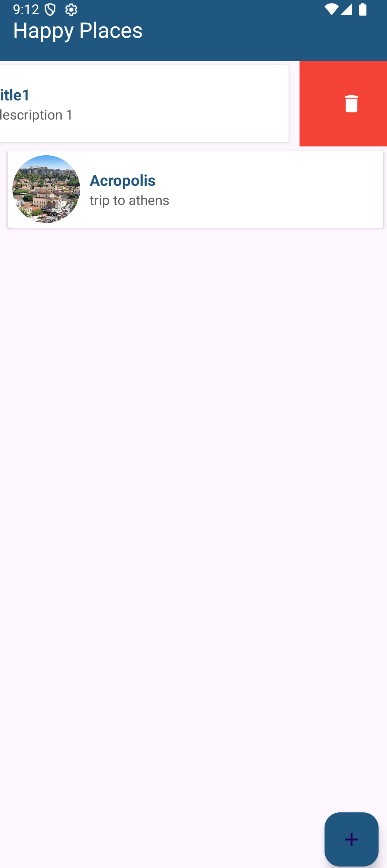
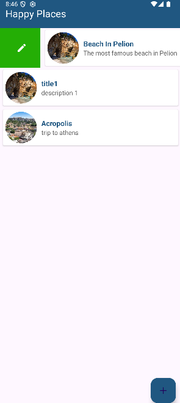

# 📍 Happy Places App

A simple mobile app for storing and managing memorable places. Perfect for keeping track of travel memories, favorite spots, or future visit ideas.

## ✨ Features

- **Add a Place**  
  Save a new place with:
  - Title  
  - Description
  - Date (by default the date of the creation or from calendar)
  - Image (from gallery or camera)  
  - Location 

- **Swipe Actions**  
  Swipe left or right on any place to:
  - **Edit** details by swiping right 
  - **Delete** the place by swiping left

- **View Mode**  
  Tap on a place to open a detailed view showing:
  - Full image  
  - Title  
  - Description  

## 📱 Screenshots

  
  
  

